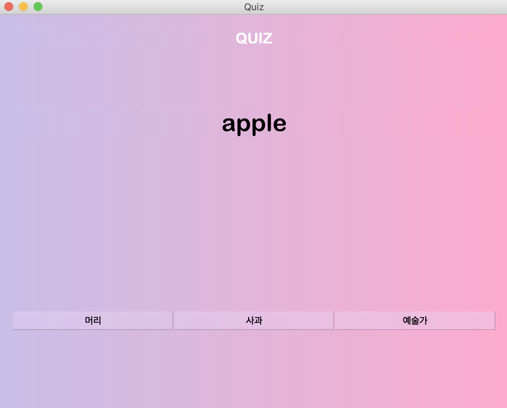

# HelloWord
영어단어 암기📝를 도와주는 PyQt앱

# 사용된 모듈
- pickle : 파일저장을 위해 사용
- Pyqt5 : UI
- csv : csv파일로 단어들을 한꺼번에 추가할 수 있음
- Gtts : 영어단어 발음을 읽어주는 기능

# 주요기능

유튜브 동영상

> daily는 내가 추가한 단어중에서 랜덤으로 20개가 보인다. 이 단어는 매일매일 바뀐다.

내가 추가한 단어들의 리스트를 확인할 수 있다.

모르는 단어를 학습할 수 있다. 3번이상 맞으면 아는 단어로 가정하고 복습단어로 넘어간다.

단어를 복습할 수있다. 단어의 발음을 출력하면 단어의 철자를 입력하면 된다.

MainWidget.py를 실행한다.

# 보고서
 - [기획서](https://docs.google.com/presentation/d/1nMkTrLpgZjENq0rEUNZ1xIjNCk5N3M9XmNbTONF8Ra4/edit#slide=id.p)
 - [요구사항 명세서](https://docs.google.com/spreadsheets/d/1zI5Dwbn5Wu9uAelIq10QN-q0UgkfJnD-qQnfHqH2zEM/edit#gid=0)
 - [클래스 인터페이스](./명세서/dds.md)
 - [단위 테스트 보고서](https://docs.google.com/spreadsheets/d/1zI5Dwbn5Wu9uAelIq10QN-q0UgkfJnD-qQnfHqH2zEM/edit#gid=225051930)
- [발표자료](./명세서/발표자료.pptx)

- 🔥🔥<b>[최종보고서(pdf)](./명세서/최종보고서.pdf)🔥🔥</b> 

